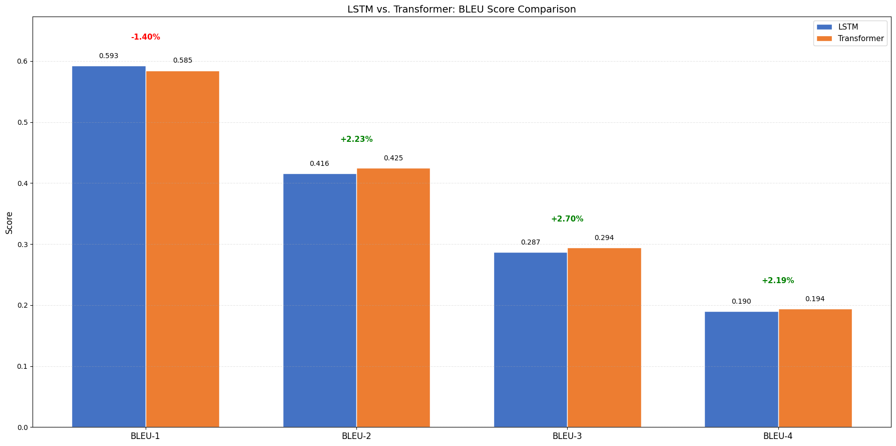
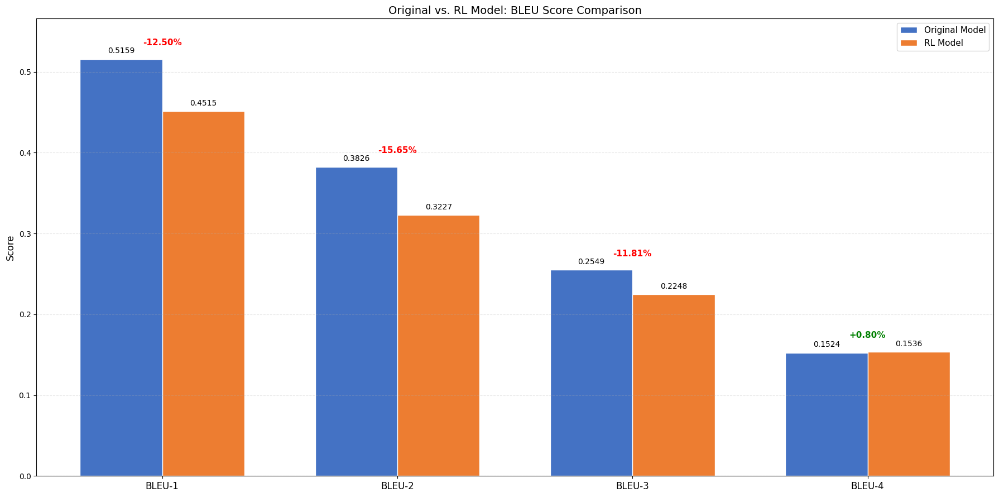
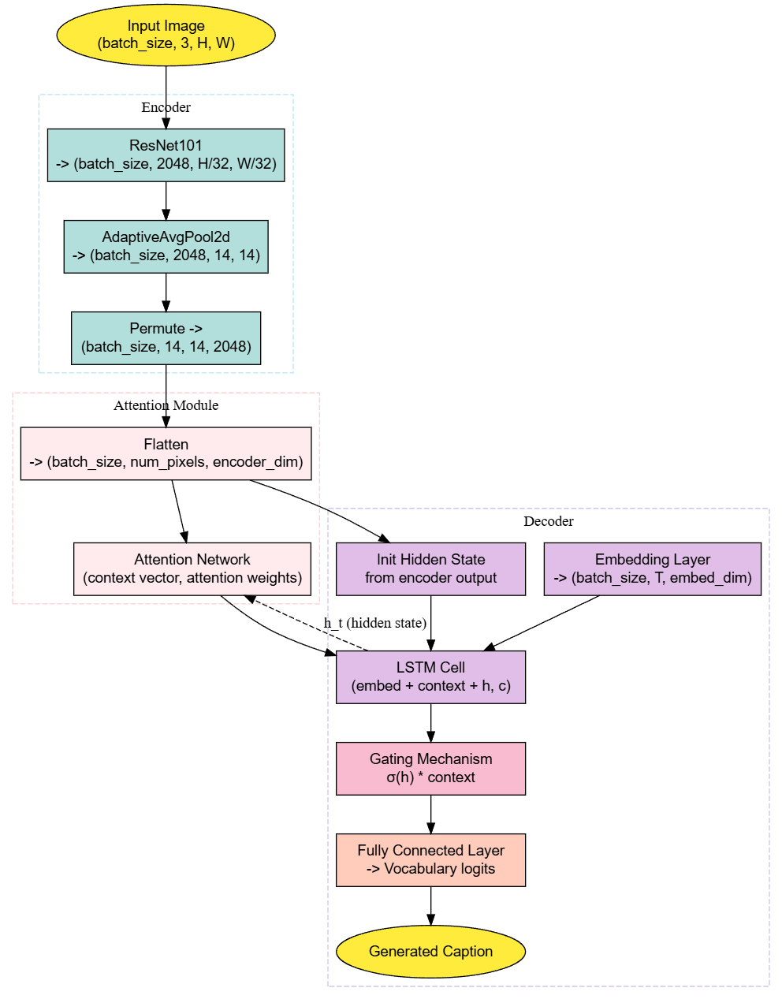
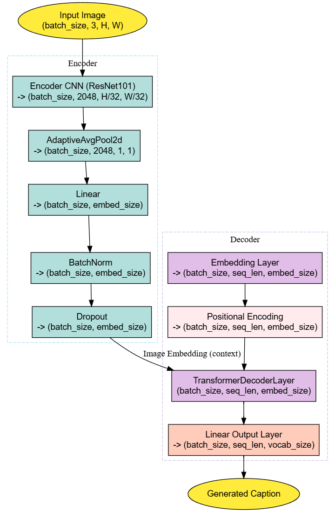
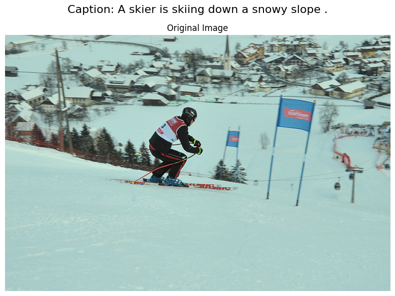

# Image Captioning: LSTM vs Transformer

A comparison of LSTM and Transformer architectures for automatic image captioning using the COCO dataset.

## Overview

This project implements and evaluates two neural network architectures for generating textual descriptions of images:
- LSTM with visual attention mechanism
- Transformer with self-attention

We train both models on the Microsoft COCO dataset and compare their performance using BLEU metrics. Additionally, we explore reinforcement learning optimization for the Transformer model.

## Results

Our findings show that:
- LSTM models excel at individual word selection (BLEU-1: +1.4%)
- Transformers generate more coherent phrases (BLEU-4: +2.2%)
- Reinforcement learning yields mixed results

*Figure 1: Comparison of LSTM and Transformer Models on BLEU Metrics*

*Figure 2: Impact of Reinforcement Learning on Transformer Performance*

## Model Architectures

### LSTM Model

- **Encoder**: ResNet-101 (Feature maps: 14×14×2048)
- **Attention**: Dynamic focus on image regions
- **Decoder**: LSTM with word embeddings
- **Training set**: 8,000 COCO images

*Figure 3: LSTM with Attention Architecture*

### Transformer Model

- **Encoder**: ResNet-101 (Global feature: 512-d)
- **Decoder**: 4-layer Transformer
- **Components**: Self-attention, cross-attention, feed-forward
- **Training set**: 12,000 COCO images

*Figure 4: Transformer Architecture*

## Example Outputs

Below are sample outputs from our models:

*Figure 5: Example images with generated captions*

## Features

- Complete implementation of both architectures in PyTorch
- Data preprocessing pipeline for COCO dataset
- Training with teacher forcing and cross-entropy loss
- Reinforcement learning optimization using SCST
- Comprehensive evaluation and visualization tools
- Qualitative comparison on COCO and internet images

## Requirements

- Python 3.8+
- PyTorch 1.8+
- torchvision
- NLTK
- pycocotools
- matplotlib
- tqdm

## License

MIT

